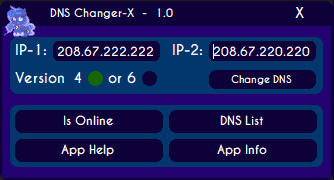

# DNS Changer-X
## Download the DNS Changer-X after reading this
>Before you click the link bellow I would recommend making sure you got the requirements.

>In order for this application to work as intended, you will need The .NET Framework version 4.7, you can find it [Here](https://dotnet.microsoft.com/download/dotnet-framework/net47).  You will also need Windows x64, you can get this [Here](https://www.microsoft.com/en-us/windows) if you do not have it already.
##
## Releases of the DNS Changer-X
### [[Download]](https://github.com/KvinneKraft/Portfolio/blob/main/DNSChanger-X/Application/1.0/DNSChanger-X.exe?raw=true) Version [1.0](https://github.com/KvinneKraft/Portfolio/blob/main/DNSChanger-X/Application/1.0/DNSChanger-X.exe?raw=true)
>This release has all of the basic functionality, it has been tested on several systems and therefore is considered a stable build.  There are no bugs for as far as I am aware right now, but if you do find any, please let me know.  Please keep in mind that the application will get rid of all of your IPv4 domain name servers if you try to set them to IPv6 from IPv4.
### 2.0 is coming!
>2.0 will have a ton of greatness!  First it is time for me to recode Dashloris-X entirely.
##
## A bit more about the DNS Changer-X
>Ever since the day I found out about spoofing IP addresses I had always been obsessed with spoofing my DNS.  I used to build application after application, piled onto each other all doing the same just a bit different.  Now though, I have brought to you a graphical interface based version of my original idea of the DNS spoofer.  

>I let these old type of projects go for a long time, but now I am able to see how I can improve my old ways and therefore put something out to be proud of.  My old projects were not the best, but these projects I work on today are literally based on drawings I made on paper.  No matter how complex I make the design seem on paper, I will blast it into reality.

>The entire GUI is custom and therefore unique.  It took quite a lot of effort to create all of these classes, because of all of the things I had to take into consideration.  Anyways, I hope you find it useful, you can also email me with any of your suggestions if you feel like it.
##
### Screenshot of the Main GUI.

