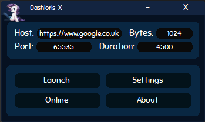
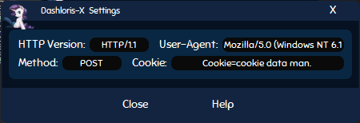
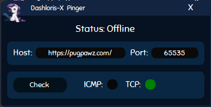

## Download the Dashloris-X
>Any of the available downloads can be found at my website: https://pugpawz.com/

>As of now my precious website is undergoing maintenance but she should be available to everyone, very soon!  If you can not wait and still want to check the Dashloris-X release out then you can head over to the Application folder and select one of the raw versions in there or, if you are atleast as lazy as me, eh, click [Me Dashloris-X.exe](Application/1.0/Dashloris-X.exe?raw=true) for version 1.0.
##
## Requirements
> You will need [The .NET Framework 4.7](https://dotnet.microsoft.com/download/dotnet-framework/net47) or above.
##
## Information about Dashloris-X
>Hey there, even though there is a special dialog dedicated
>to the information that I want to share about this application
>within the application already, I still feel like I have to
>address a few things.  This application was made for personal use only until I discovered
>the use others may see within its shadow.  Therefore I present to
>you the official (long postponed) Dashloris-X!  

>This application will allow you to test web-servers their bandwidth using a more
>advanced version of Slowloris, going by the name of Dashloris-X. Dashloris-X has a lot of customization that comes with it and a lot of other features I have not yet seen present among other variants of the original Slowloris.

>Not only did I take my time to fully custom code all of the interfaces and a lot of the classes but, I also made sure all the code is ready for update whenever my Dash senses tingle.  I both took in mind the potential destined future of my application and the distinctiveness I wanted to present to the user.  

>This application is unique in its own type of way.  And all of that within just 2 weeks.  My back has severe pains now, but it is worth it, ahaha.
##
## Screenshots of Dashloris-X
### Main Panel:

### Settings GUI:

### Ping GUI:

##
>Please keep in mind that there is a lot more to come but also
>know that the above screenshots only show a small part of the 
>entire application, there is a lot to go through.  

>Future updates await much functionality, I will need people their 
>feedback in order to improve this piece of software.  If you yourself
>feel like you have found something wrong or perhaps have a decent
>suggestion, please contact me at KvinneKraft@protonmail.com.