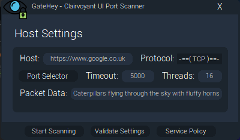
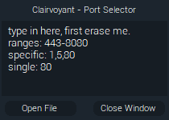
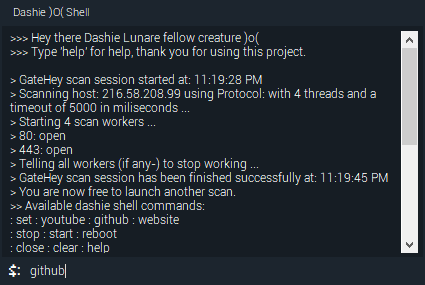

# Simple yet effective port scanner: Gate Hey!
### A project made for the sole purpose of experimentation.  With this, you will be able to find open ports on any server willing to accept your connections.  All you will have to do is fill in the settings to your liking and press the launch button!
##
## Gate Hey Downloads:
### Version 1.0 can be donwloaded [here](https://github.com/KvinneKraft/Software/blob/main/GateHey/app/1.0/GateHey.exe?raw=true)
> This version is the first version of the Gate Hey project.  This release contains the basic functionality, such as the ability to set packet data but also the ability to specify single, multiple and ranged ports in the popup GUI.  File imports are also supported.
##
## Screenshots:
### Main GUI Window

### Port Selector Window

### Interactive Shell Window

##
> One of the main features of this program is the self made terminal allows easier use of the tool.  A popout window which you can use, unless you wish to use the GUI which is also possible.  The future beholds many beautiful modifications, but for now, this is what I got for you.

> If you find any issues or have any suggestions then please reach out to me at: KvinneKraft(at)protonmail(dot)com.  The future beholds improvements!  See bellow some of the requirements.
##
## The Requirements
> You will need The .NET Framework version 4.7 or above, you can find The .NET Framework version 4.7 [Here](https://dotnet.microsoft.com/download/dotnet-framework/net47).

> You will also need Windows x64 bit, which you can find [Here](https://www.microsoft.com/en-us/windows) if you do not have it already.