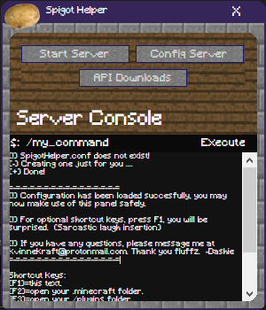
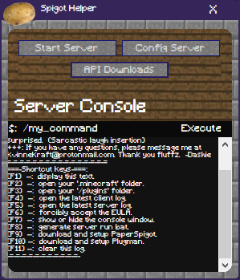

# Local Minecraft Server Helper:  Spigot Helper
### A tool to increase productivity by allowing you -as a developer- to update the plugins in your local '/plugins' folder automatically by setting up the configuration file properly.  All using a few clicks and key-presses; this plugin even comes with an integrated terminal and log opener and many more plucks of functionality a Minecraft spigot developer needs.
### The idea is quite simple, but the user-interface and functionality of this application are quite the gem, it even comes with its own configuration file.  Just like a spigot plugin ;)
##
## Spigot Helper Downloads
### Version 1.0 can be downloaded [here](https://github.com/KvinneKraft/Software/raw/main/SpigotHelper/app/1.0/SpigotHelper.exe?raw=true).
> This version is the first version and comes with first version functionality (ironically), this functionality includes a terminal which (as of now) only allows server commands to be processed.  The next update will come with integrated commands which would allow user-interaction with the system the user is on.  Other interesting things this application has to over are the automatic configuration file loader and the auto plugin loader (with integrated plugman support).
### Version 2.0 can be downloaded [here](https://github.com/KvinneKraft/Software/raw/main/SpigotHelper/app/2.0/SpigotHelper.exe?raw=true)
> This version is the second version and comes with a ton of functionality and overall code improvements.  I have completely refactored the project which means all of the code is a lot more organized.  I have also fixed a ton of bugs which prevented new users from using the actual application itself.  The program functions a lot more efficiently now.

> This release also comes with a ton of functionality upgrades, and a lot more user-friendly log-feedback from the code-side of the application.  This will make it easier to keep track of what is going on.  One of the many things which is really nice is the ability to automatically update your server with just one keypress.  To be honest, there have been so many changes, if you are really curious I would recommend checking out the commitments made towards this project.

> Either way, the next update will bring even more to the table such as individual dialogs for the personalization of files and downloads and more!  Stay tuned.  -Dashie 
##
## Screenshots
### Version 1.0 Main GUI

##
### Version 2.0 Main GUI

##
> The terminal and other parts of this application are going to be improved (perhaps even completely recoded) in the near future, when new updates surface the new functionality does as well.  If any issues are found or you have any suggestions then please let me know at KvinneKraft@protonmail.com. Thank you.
##
### Default Configuration File
```txt
config_loader_interval=10
plugin_loader_interval=10
use_plugman=True
server_bat=F:\Programming\PrivateSociety\Minecraft\Server\run.bat
server_dir=F:\Programming\PrivateSociety\Minecraft\Server
update_dir=F:\Programming\MCSpigot\VoyantSMP
```
##
## The Requirements
> You will need The .NET Framework version 4.7 or above, you can find The .NET Framework version 4.7 [Here](https://dotnet.microsoft.com/download/dotnet-framework/net47).

> You will also need Windows x64 bit, which you can find [Here](https://www.microsoft.com/en-us/windows) if you do not have it already.