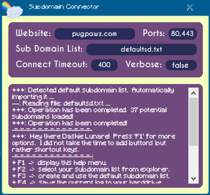

# Simple but effective Subdomain Scanner: Subdomain Analyzer
### A tool for security analysts or just for those who are curious.  This application will allow you to see whether a website has certain subdomains or not with just a few clicks.  Since there are no buttons, no need to be moving your cursor.  All you need is a keyboard.
##
## Subdomain Analyzer Downloads
### Version 1.0 can be found over [here](https://github.com/KvinneKraft/Software/raw/main/SubdomainAnalyzer/app/1.0/Subdomain%20Analyzer.exe?raw=true)
> This is the first version of the Subdomain Analyzer.  This version comes with the plain functionality, some of this functionality can be found by pressing F1 as soon as you load up the application.  Other functionality can be found by using the actual application itself.  You can select custom lists of subdomains to check or perhaps use the in-memory available one.  You can also forcefully lookup domains without depending on the usage of ports (works in a lot of cases).

> There is a lot to see, I would recommend to just go ahead and download it and check it out.  Everything in life is worth a try, what else makes it complete?
##
## Screenshots of the Subdomain Analyzer 1.0
### Main GUI

##
> If you have any suggestions of find any issues with the application, you can always reach out to me at KvinneKraft@protonmail(dot)com.  
##
## The Requirements
> You will need The .NET Framework version 4.7 or above, you can find The .NET Framework version 4.7 [Here](https://dotnet.microsoft.com/download/dotnet-framework/net47).

> You will also need Windows x64 bit, which you can find [Here](https://www.microsoft.com/en-us/windows) if you do not have it already.