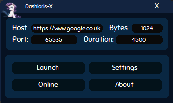
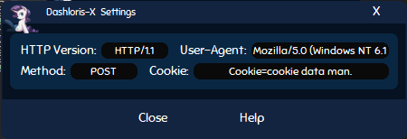
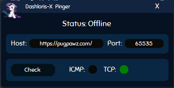
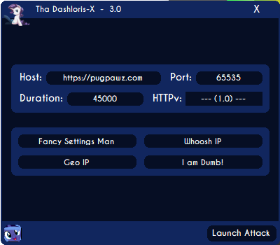
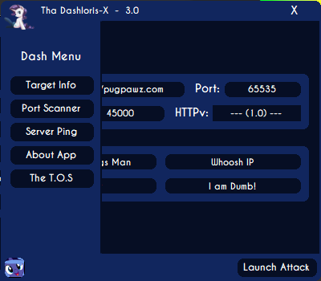
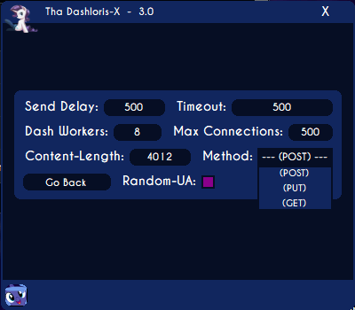
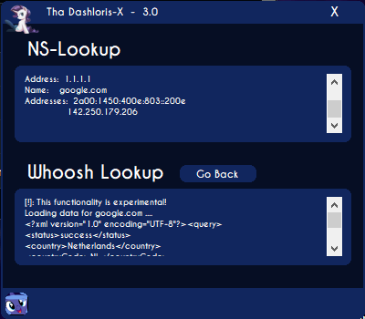
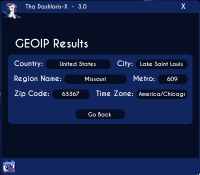
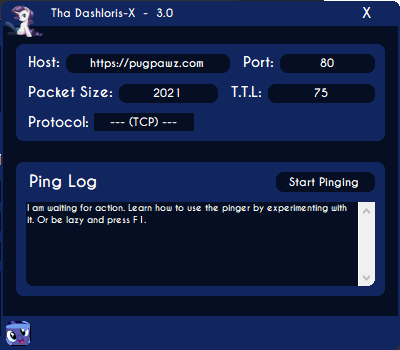

## Download the The Dashloris-X
>I would recommend checking the information section first before downloading The Dashloris.

>You can find all (including unstable) builds [Here](https://github.com/KvinneKraft/Software/tree/main/TheDashlorisX/application) on my GitHub but also [Here](https://pugpawz.com) on my website.  Please know that some versions may contain bugs, if you do find any, please reach out to me at KvinneKraft@protonmail.com about the matter, I want to squash them all and throw salt on them lil bastards (It is worth mentioning that, I would never do such a thing to a living being).
##
## Release information about the Dashloris-X
### Version [1.0](https://github.com/KvinneKraft/Software/raw/main/TheDashlorisX/application/1.0/Dashloris-X.exe?raw=true)
> This version is the first version publicly released.  This version contains quite a few errors and overall bugs.  The main purpose of this release was to share what worked in a way that was not too lazy yet easy.
### Version [2.0](https://github.com/KvinneKraft/Software/raw/main/TheDashlorisX/application/2.0/Dashloris-X.exe?raw=true)
> This beautiful release comes with a lot, and when I say a lot, I mean a lot of bug fixes (All the features I implement are written down on paper, too much to write over into this document.) but also a lot of features, such as custom message boxes, improved error handling and much, much more!  This version took quite some time to develop, but it is here!  (Due to optimizations the Dashloris-X attack has become very powerful!)
### Version [3.0](https://github.com/KvinneKraft/Software/raw/main/TheDashlorisX/application/3.0/TheDashloris-X.exe?raw=true)
> This release took a few months to put together, this is because version three of the Dashloris-X is very advanced in comparison to its previous versions.  When I talk about advanced, I am implying the availability of new functionality and a completely redone interface + code (check bellow screenshots).

> This release includes a decent Port Scanner, Server Pinger and a Nameserver Lookup and Geo IP Tool.  Plus a ton more things, you will have to experiment with this application if you want to discover these things. 
##
## Future of The Dashloris-X
>To be honest, I have a lot of designs laying around and a lot of things on my to-do list.  On a daily I am able to mark off atleast 10 things, that may seem like a lot until you realize I add about 20 new ideas to my to-do list on a daily, ahaha.  An endless circle of self satisfaction is what I consider it to be.

>But to get to the point, the future of Dashloris-X is uncertain, just like anything else in life, but, I do have a lot of things planned for this piece of software.  The expansion it will face is far beyond my ordinary standards.  I also have plenty of other designs to work on, which means you will come across a lot on my page very soon!

>A small spoiler though, I am going to be working on a "new features" section in this README when the next update of the Dashloris-X comes out!  Stay tuned.
##
## Screenshots of The Dashloris-X 1.0 and 2.0
### Main Panel:

### Settings GUI:

### Ping GUI:

##
## Sceenshots of The Dashloris-X 3.0
### Main Panel:

### Main Panel + Side Menu:

### Settings GUI: 

### NS Lookup GUI:

### GeoIP GUI:

### Port Scan GUI:

### Ping GUI:

##
## Information about The Dashloris-X
>Hey there, even though there is a special dialog dedicated to the information that I want to share about this application within the application already, I still feel like I have to address a few things.  This application was made for personal use only until I discovered the use others may see within its shadow.  Therefore I present to you the official (long postponed) Dashloris-X!  

>This application will allow you to test web-servers their bandwidth using a more advanced version of Slowloris, going by the name of Dashloris-X. Dashloris-X has a lot of customization that comes with it and a lot of other features I have not yet seen present among other variants of the original Slowloris.

>Not only did I take my time to fully custom code all of the interfaces and a lot of the classes but, I also made sure all the code is ready for update whenever my Dash senses tingle.  I both took in mind the potential destined future of my application and the distinctiveness I wanted to present to the user.  

>This application is unique in its own type of way.  And all of that within just 2 weeks (the first release being coded within 2 weeks).  My back has severe pains now, but it is worth it, ahaha.
##
## The Requirements
> You will need The .NET Framework version 4.7 or above, you can find The .NET Framework version 4.7 [Here](https://dotnet.microsoft.com/download/dotnet-framework/net47).

> You will also need Windows x64 bit, which you can find [Here](https://www.microsoft.com/en-us/windows) if you do not have it already.